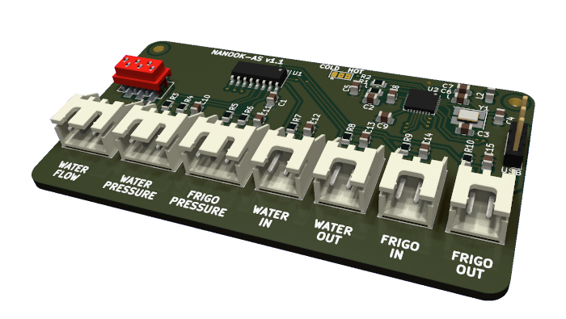

# nanook-as
NANOOK analog sensors board

 

|COLD        |WATER IN |WATER OUT|FRIGO IN|FRIGO OUT|
|------------|---------|---------|--------|---------|
|            |   R5    |   R6    |   R7   |   R8    |
| t          |-15..15  |-15..15  |-15..15 |-15..15  |
| R          |56k      |56k      |56k     |56k      |

|HOT         |WATER IN |WATER OUT|FRIGO IN|FRIGO OUT|
|------------|---------|---------|--------|---------|
|            |   R5    |   R6    |   R7   |   R8    |
| t          |10..60   |10..70   |10..130 |10..60   |
| R1         |4k7      |4k7      |1k5     |4k7      |
