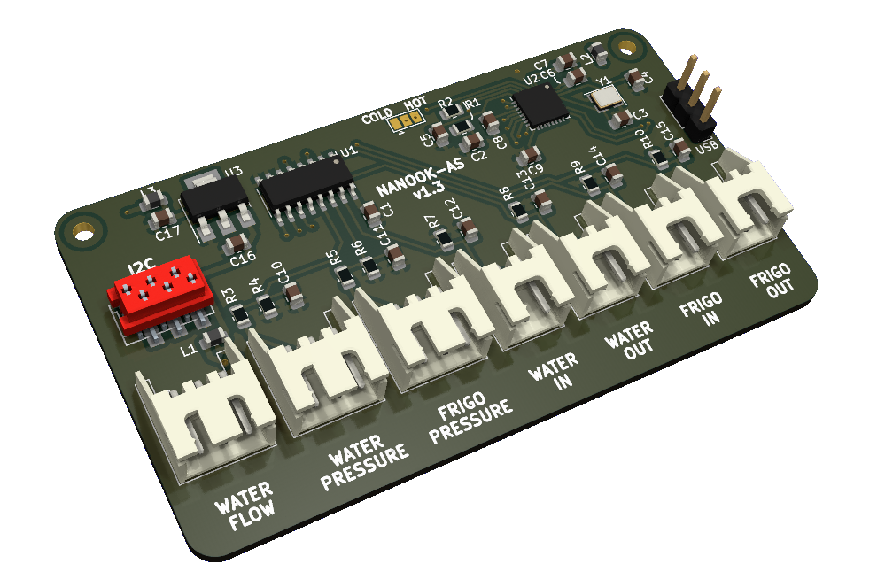

# nanook-as
NANOOK analog sensors board

 

Temperature sensor divider R2=4k7 calculated for range:

|   | temp  |R1 (NTC 3950/10k) |  R2 | Vout   |
|---|-------|------------------|-----|--------|
|min| -24°C | 110k             | 4k7 | 102mV  |
|max| 175°C | 0.1027k          | 4k7 | 2446mV |

